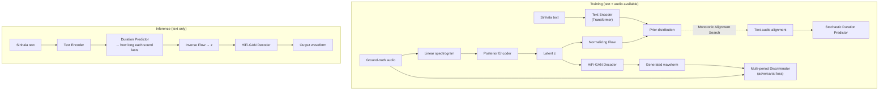
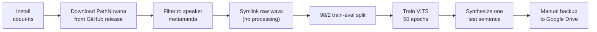
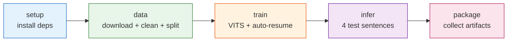
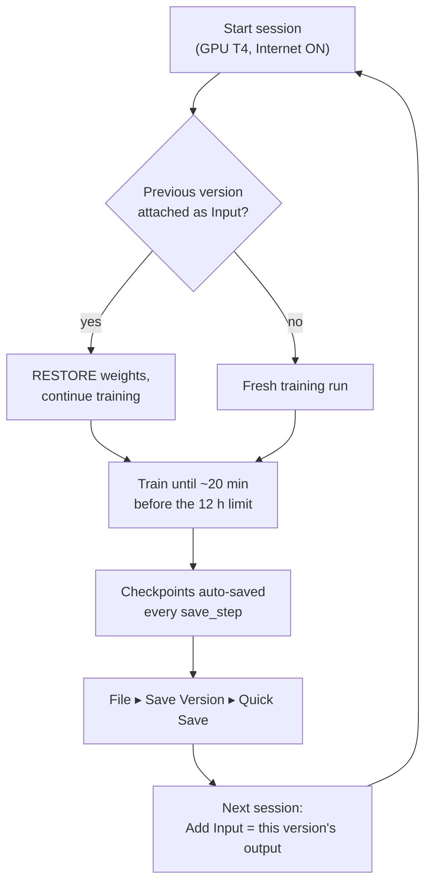

# Sinhala TTS — Baseline Models (PathNirvana)

Baseline **Text-to-Speech** models for Sinhala, built for the University of Moratuwa
CS3501 project *"Development of a Natural-Sounding Sinhala TTS System"*
(Group 18 / P15). Both baselines train a **VITS** acoustic model on the
[PathNirvana Sinhala TTS dataset](https://github.com/pnfo/sinhala-tts-dataset)
and form **Track A** (from-scratch VITS) of the wider project. Track B (F5-TTS
with LoRA adapters) and the text frontend are documented separately.

This README explains **how the baseline evolved** from a Colab proof-of-concept
(`baseline_v1.py`) to a production-grade, quota-aware Kaggle pipeline
(`baseline_v2.py`), and *why* each change was made.

---

## Contents

- [The models at a glance](#the-models-at-a-glance)
- [What is VITS? (shared architecture)](#what-is-vits-shared-architecture)
- [v1 — Colab proof-of-concept](#v1--colab-proof-of-concept)
- [v2 — Staged Kaggle pipeline](#v2--staged-kaggle-pipeline)
- [Why the output still sounds unnatural: the undertraining story](#why-the-output-still-sounds-unnatural-the-undertraining-story)
- [How to run](#how-to-run)
- [Dataset](#dataset)
- [Roadmap](#roadmap)

---

## The models at a glance

| | **v1** (`baseline_v1.py`) | **v2** (`baseline_v2.py`) |
|---|---|---|
| **Platform** | Google Colab (`/content`, `google.colab`) | Kaggle (`/kaggle`), also runs locally |
| **Form** | Linear notebook cells, shell magics (`!pip`, `!wget`) | Importable script with staged CLI (`--stage`) |
| **Model** | VITS from scratch (Coqui-TTS) | VITS from scratch (Coqui-TTS) — *same model* |
| **Speaker** | `mettananda` (male, ~5.4k clips) | Selectable: `mettananda` / `oshadi` |
| **Dataset source** | GitHub download only | Attached Kaggle Input → kagglehub → GitHub fallback |
| **Audio preprocessing** | Symlink raw wavs as-is | Trim silence, loudness-normalize (~-24 LUFS), pad, filter 1–12 s |
| **Text preprocessing** | Strip repetition marker only | + guaranteed sentence-final punctuation, punctuation kept in vocab |
| **Training length** | 50 epochs (fixed) ≈ **8.5k steps** | Resume-until-good; accumulate **100k+ steps** across sessions |
| **Crash safety** | None — a dropped session loses everything | Auto-resume from checkpoints (same session or previous version) |
| **Verification** | None — commit full quota blind | `--smoke` end-to-end run (~100 clips / 3 epochs, 15–25 min) |
| **Backup** | Manual Google Drive mount | `--stage package` + Kaggle "Save Version" |

**In one line:** v1 proved the model *trains*; v2 makes it *finish*, *resume*, and
*sound cleaner* under Kaggle's 30 h/week GPU quota.

---

## What is VITS? (shared architecture)

Both baselines use **VITS** (*Variational Inference with adversarial learning for
end-to-end Text-to-Speech*, Kim et al., ICML 2021). It is a **single-stage** model
— text goes in, a waveform comes out, with no separate vocoder to train. It
combines a conditional **VAE**, **normalizing flows**, a **HiFi-GAN** waveform
decoder, and a **stochastic duration predictor** (the part that gives speech its
natural rhythm and pauses).



**Why this matters for Sinhala naturalness:** the *stochastic duration predictor*
learns pause and rhythm patterns from the **punctuation** in the training text —
which is exactly why v2 invests in punctuation hygiene (below). No punctuation in,
no learned pauses out.

Both versions use the same audio front-end settings: **22.05 kHz**, 80 mel bands,
`win_length=1024`, `hop_length=256`, grapheme (character) input,
`multilingual_cleaners`, mixed-precision training.

---

## v1 — Colab proof-of-concept

`baseline_v1.py` is a Colab notebook exported to a `.py` file. It runs top-to-bottom
as independent cells and answers one question: *"Can VITS train on PathNirvana at
all?"* The answer was yes.



**What it established**
- The full Coqui-TTS + PathNirvana wiring works end-to-end.
- A `torchaudio.info` fallback patch (some wavs fail the fast metadata read).
- A restart-proof vocabulary built from the metadata file, not a live DataFrame.

**Limitations that motivated v2**
- **Colab-locked:** `/content` paths, `!` shell magics, and `from google.colab
  import drive` do not run on Kaggle or as a plain script.
- **Fixed 50 epochs (~8.5k steps)** — far too few for VITS-from-scratch (see below).
- **No crash safety:** if the session dies mid-training, all progress is lost.
- **Raw audio:** wavs are symlinked untouched — inconsistent loudness, leading/
  trailing silence (which teaches the model *bad stops*), and no length filtering.
- **No verification:** you only find out something is broken *after* spending GPU time.

---

## v2 — Staged Kaggle pipeline

`baseline_v2.py` is the same VITS model wrapped in an engineering harness built
around Kaggle's constraints (30 GPU-hours/week, 12 h sessions, sessions that
sometimes die). It is a proper CLI with five composable stages.



### Key improvements and *why*

| Improvement | What it does | Why it matters |
|---|---|---|
| **Smoke test** (`--smoke`) | Full pipeline on ~100 clips / 3 epochs in 15–25 min | Catches breakage *before* you spend precious quota on a run that fails after hours |
| **Crash-safe resume** | Detects checkpoints in `/kaggle/working` (same session) or an attached previous version, and continues | Lets you accumulate 100k+ steps across many short sessions instead of losing progress |
| **Audio hygiene** | Trim silence, loudness-normalize to ~-24 LUFS, pad onsets/endings, keep only 1–12 s clips | Consistent loudness + clean, padded endings → the model learns **clean stops** instead of trailing babble |
| **Text hygiene** | Guarantee a sentence-final `.`/`?`/`!`; keep punctuation in the vocab | Gives the duration predictor the punctuation cues it needs for **pauses and rhythm** |
| **Flexible data source** | `--dataset-dir` / attached Kaggle Input, else GitHub | Avoids re-downloading ~700 MB and hitting GitHub rate limits every session |
| **`--phonemes` flag** | espeak-ng Sinhala phoneme input | One-flag toggle for the project's **E2 experiment** (graphemes vs phonemes) |
| **Deterministic vocab** | Vocabulary rebuilt from manifests every run | Keeps the character set stable across sessions so a checkpoint always matches |

### The cross-session resume flow

Kaggle wipes `/kaggle/working` between interactive sessions, so v2 is designed to
be run in chunks:



> **Rule:** keep preprocessing flags identical across sessions (same `--speaker`,
> same `--phonemes`). The vocabulary must match the checkpoint or resume fails.

---

## Why the output still sounds unnatural: the undertraining story

The single biggest reason v1's audio sounds robotic is **not the dataset — it is
training length.**

- v1 trains **50 epochs × (~5,400 clips / batch 16) ≈ 8,500 steps**.
- The VITS paper trains LJSpeech for **~800,000 steps**.
- Usable naturalness for a from-scratch single-speaker voice typically begins
  around **100k+ steps**.

So v1 stopped at roughly **1%** of a full training schedule. v2's entire
resume-across-sessions design exists to cross that gap on a quota that only allows
a few hours at a time. Data-hygiene and punctuation fixes help the *ceiling*, but
**step count is the first-order lever** — this is also what the project's **E4
(data-scale)** experiment is meant to characterise.

**What a baseline VITS still cannot do:** *controllable emotion*. That requires
reference-conditioned synthesis and is deferred to **Track B (F5-TTS)**. v2's clean,
normalized data is produced in a form Track B can reuse directly, so none of the
data work is wasted.

---

## How to run

### v2 on Kaggle (recommended)

Create a notebook, set **Accelerator = GPU T4** and **Internet = On**, then one cell each:

```python
!git clone https://github.com/DSEgrp18/baseline-pathnirvana.git repo
!python repo/baseline_v2.py --stage setup
!python repo/baseline_v2.py --stage all --smoke   # verify end-to-end first
!python repo/baseline_v2.py --stage all           # real training
```

Useful flags: `--speaker oshadi`, `--phonemes` (E2 experiment),
`--dataset-dir <path>` (attached/kagglehub dataset), `--epochs`, `--batch`.

### v1 on Colab

Open `baseline_v1.py` as a Colab notebook and run the cells top to bottom
(it depends on `/content` paths and Google Drive; it will **not** run on Kaggle).

---

## Dataset

**PathNirvana Sinhala TTS** — [`pnfo/sinhala-tts-dataset`](https://github.com/pnfo/sinhala-tts-dataset)
`v2.1` (~13.6 h). Two speakers: `mettananda` (male, ~11.6 h) and `oshadi`
(female, ~2 h). `metadata.csv` is pipe-delimited with no header:

```
file_id | romanized | sinhala | speaker
```

Related openly-licensed corpora for later experiments: OpenSLR
[SLR30](https://www.openslr.org/30/) (clean multi-speaker TTS) and
[SLR52](https://www.openslr.org/52/) (large Sinhala ASR — useful for training an
aligner/ASR, both CC BY-SA 4.0).

---

## Roadmap

- [x] **v1** — prove VITS trains on PathNirvana (Colab)
- [x] **v2** — quota-aware, crash-safe, hygienic Kaggle pipeline
- [ ] Long-run training to 100k+ steps (cross the naturalness threshold)
- [ ] E2 (graphemes vs phonemes), E4 (data-scale curve)
- [ ] Female-voice fine-tuning (`oshadi`)
- [ ] **Track B** — F5-TTS + LoRA for expressiveness and code-switching
- [ ] Evaluation harness (Whisper WER + native-speaker MOS)

---

*Track A baseline for the UoM CS3501 Sinhala TTS project. See the project proposal
in [`Reports/`](Reports/) for the full system design and evaluation plan.*
