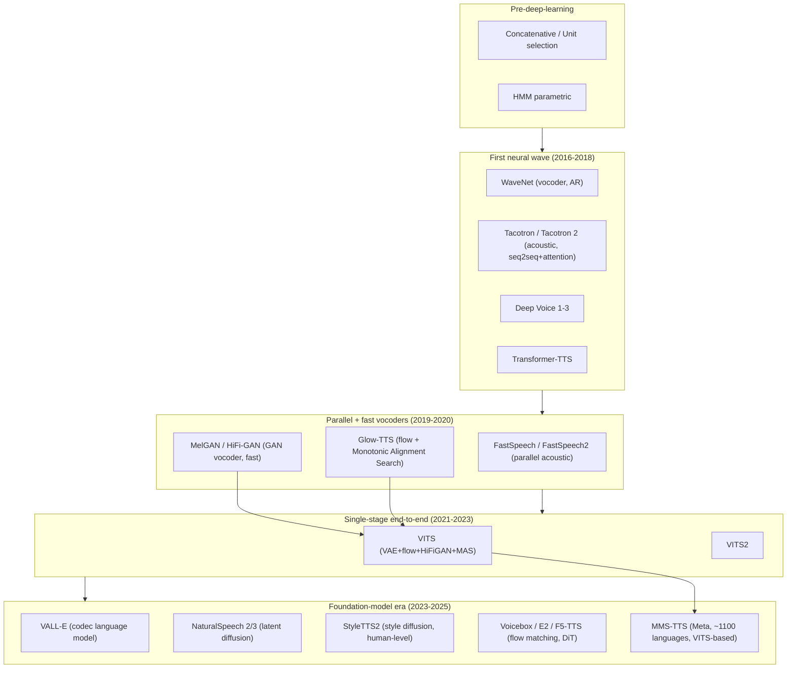

# Neural Text-to-Speech for Sinhala: Architecture Evolution, Current Approaches, and Research Gap

*A working research document for the UoM CS3501 project "Development of a
Natural-Sounding Sinhala TTS System" (Track A: VITS; Track B: F5-TTS).*

---

## Contents
1. [Motivation](#1-motivation)
2. [The evolution of TTS architectures](#2-the-evolution-of-tts-architectures)
3. [Where our current work sits](#3-where-our-current-work-sits)
4. [What we can update (enhancements)](#4-what-we-can-update-enhancements)
5. [The research gap](#5-the-research-gap)
6. [Proposed novel contributions](#6-proposed-novel-contributions)
7. [Roadmap](#7-roadmap)
8. [References](#8-references)

---

## 1. Motivation

Sinhala is spoken by ~17 million people yet remains **low-resource** for speech
technology: few open corpora, no standardized TTS benchmark, and no published
natural-sounding, expressive, open Sinhala TTS system. General TTS architecture
has advanced enormously (near-human naturalness in English/Chinese), but these
advances have **not been systematically transferred to or evaluated on Sinhala**.

This document (a) traces how TTS architectures evolved, (b) positions our two
tracks within that evolution, (c) lists concrete upgrades, and (d) articulates a
defensible **research gap** and the novel contributions that close it.

---

## 2. The evolution of TTS architectures

TTS evolved along four intertwined threads. Understanding them is what makes our
model choices — and our research gap — defensible.

### 2.1 The lineage at a glance

### 2.2 Thread A — Two-stage → single-stage end-to-end
Early systems separated an **acoustic model** (text→spectrogram) from a
**vocoder** (spectrogram→waveform): e.g. Tacotron 2 + WaveNet. FastSpeech 2 +
HiFi-GAN made both stages fast. **VITS (2021)** fused them into a single
end-to-end model — a conditional VAE with normalizing flows, an integrated
HiFi-GAN decoder, Monotonic Alignment Search, and a stochastic duration
predictor. **VITS2 (2023)** refined the duration predictor and alignment.
*→ Our Track A lives at the end of this thread.*

### 2.3 Thread B — Alignment became robust
Tacotron's content-based attention was fragile (word skips/repeats).
FastSpeech used an external aligner (hard alignment). **Monotonic Alignment
Search (MAS)** in Glow-TTS/VITS made alignment learned and monotonic — the main
reason VITS trains stably on modest data. *Robust alignment matters most in the
low-resource regime.*

### 2.4 Thread C — Vocoders: from slow AR to fast, universal
WaveNet (autoregressive, high quality, very slow) → Parallel WaveNet / WaveGlow
(flow, parallel) → **MelGAN / HiFi-GAN** (GAN, fast, high quality) → **BigVGAN /
Vocos** (2022+, universal, robust to unseen speakers/languages). HiFi-GAN lives
*inside* VITS; F5-TTS uses Vocos/BigVGAN.

### 2.5 Thread D — The paradigm shift: from per-dataset training to foundation models
The biggest recent change is conceptual. Older models are **trained from scratch
per dataset/voice**. Since 2023, the field adapts **massively-pretrained
multilingual foundation models** and does **zero-shot** voice cloning from a few
seconds of reference audio:

- **VALL-E (2023)** — reframes TTS as *language modeling over neural audio codec
  tokens* (EnCodec). Zero-shot from ~3 s.
- **NaturalSpeech 2/3 (2023)** — latent diffusion.
- **StyleTTS2 (2023)** — style diffusion + adversarial training; **first to reach
  human-level naturalness** on public benchmarks, and **~250× more data-efficient
  than VALL-E**, running in ~2 GB VRAM.
- **Voicebox / E2-TTS / F5-TTS (2023-2024)** — **flow matching** on a Diffusion
  Transformer; text-guided infilling; expressiveness via a reference clip.
- **MMS-TTS (Meta, 2023)** — pretrained **VITS** models for ~1,100 languages
  (a per-language checkpoint), enabling transfer learning for low-resource
  languages.

Expressiveness evolved in parallel: Global Style Tokens (2018) → reference
encoders → **style diffusion (StyleTTS2)** and **reference conditioning (F5-TTS)**.
*Emotion is now delivered by conditioning, not by baking it into one model.*

### 2.6 Summary table

| Model | Year | Category | Paradigm | Key idea |
|---|---|---|---|---|
| Tacotron 2 | 2017 | Acoustic + WaveNet | From-scratch | Seq2seq + attention |
| FastSpeech 2 | 2020 | Parallel acoustic | From-scratch | Non-AR, pitch/energy |
| HiFi-GAN | 2020 | Vocoder | From-scratch | Fast GAN vocoder |
| Glow-TTS | 2020 | Flow TTS | From-scratch | MAS alignment |
| **VITS** | 2021 | **End-to-end** | **From-scratch** | VAE+flow+HiFiGAN — *Track A* |
| VITS2 | 2023 | End-to-end | From-scratch | Better duration/MAS |
| VALL-E | 2023 | Codec LM | Foundation/zero-shot | Audio tokens as language |
| StyleTTS2 | 2023 | Style diffusion | Foundation/data-efficient | Human-level naturalness |
| MMS-TTS | 2023 | VITS per-language | **Transfer** | ~1100 pretrained langs |
| **F5-TTS** | 2024 | Flow-matching DiT | **Foundation/zero-shot** | Reference conditioning — *Track B* |

> **MOS caveat:** naturalness scores across papers use different datasets,
> languages, and listener pools — they are **not** directly comparable.

---

## 3. Where our current work sits

Our project deliberately spans the two dominant paradigms:

### 3.1 Track A — VITS from scratch (`baseline_v2.py`)
End-of-Thread-A, single-stage, trained from scratch on the PathNirvana corpus
(~13.6 h). **Status:** reproducible Kaggle pipeline verified end-to-end; first
checkpoint at ~36k steps, resuming toward ~100k. **Limitation:** from-scratch on
~11.6 h single-speaker data is the *old* low-resource paradigm and is
compute-bound (naturalness needs ≥100k steps).

### 3.2 Track B — F5-TTS fine-tuning (`baseline_v3.py`)
Thread-D foundation model. Fine-tunes a pretrained flow-matching DiT on Sinhala
(requires vocabulary extension, since the base has never seen Sinhala script).
Delivers expressiveness via reference conditioning and handles English islands
(code-switching). **Status:** pipeline drafted, pending Kaggle shakeout.

### 3.3 Key empirical finding so far
The dominant cause of unnatural output in Track A is **undertraining, not data**:
the original 50-epoch baseline (~8.5k steps) is ~1% of a full VITS schedule
(~800k for LJSpeech). This reframes the problem and motivates both the
resume-based training design and the transfer-learning direction below.

---

## 4. What we can update (enhancements)

Concrete upgrades the evolution points to, prioritized for our Kaggle /
low-resource constraints:

| # | Enhancement | Evolutionary basis | Impact | Effort |
|---|---|---|---|---|
| 1 | **Fine-tune `facebook/mms-tts-sin`** (pretrained Sinhala VITS) instead of from scratch | Thread D transfer learning | ★★★ | Low |
| 2 | **Add StyleTTS2** as a track | SOTA naturalness, data-efficient | ★★★ | Med |
| 3 | **VITS → VITS2** config (transformer duration predictor, improved MAS) | Thread A/B refinement | ★★ | Med |
| 4 | **Phoneme input + espeak-ng G2P** (experiment E2) | Low-resource intelligibility | ★★ | Low |
| 5 | **Vocoder swap HiFi-GAN → BigVGAN/Vocos** | Thread C robustness | ★ | High |
| 6 | **F5-TTS with BigVGAN + LoRA + vocab extension** | Thread D done right | ★★★ | Med |

**Caveat on #1:** MMS-TTS is CC-BY-NC 4.0 (non-commercial) — acceptable for
academic research, but constrains redistribution/deployment.

---

## 5. The research gap

Modern TTS methods exist, but for **Sinhala** they are largely untested,
unbenchmarked, and unintegrated. Five concrete gaps:

### Gap 1 — No systematic paradigm comparison for Sinhala
The field offers three distinct paradigms — **(a) from-scratch end-to-end**,
**(b) transfer learning from a multilingual pretrained model**, and **(c)
zero-shot foundation-model adaptation** — but **no study compares them on
Sinhala** under matched data and evaluation. It is unknown which is best for a
low-resource Indic language at ~10–15 h of data.

### Gap 2 — No standardized Sinhala TTS evaluation benchmark
There is **no published, reproducible quality benchmark** (MOS + intelligibility
WER) for Sinhala TTS. Existing systems report no comparable numbers, making
progress unmeasurable.

### Gap 3 — Sinhala–English code-switching is unaddressed
Everyday Sinhala heavily interleaves English words ("English islands"). Most TTS
mispronounces or drops them, and **no work systematically studies code-switched
Sinhala TTS** or compares strategies (transliteration vs. dual-script vocab vs.
foundation-model handling).

### Gap 4 — Expressive / emotional Sinhala TTS does not exist
No open Sinhala system offers **controllable expressiveness/emotion**, and there
is neither expressive Sinhala data nor a method adapted to it.

### Gap 5 — No reproducible, license-aware low-resource data pipeline
Sinhala corpora are scarce and licensing is unclear. There is **no manifest-first,
reproducible pipeline** (source → clean → align → filter → manifest) that lets
others regenerate a high-quality Sinhala TTS corpus from public originals.

> **Consolidated gap statement (for the report):** *"Despite rapid progress in
> neural TTS, there is no systematic, reproducible comparison of modern TTS
> paradigms — from-scratch, transfer-learning, and foundation-model adaptation —
> for Sinhala, no standardized evaluation benchmark, and no principled treatment
> of Sinhala–English code-switching or expressiveness."*

---

## 6. Proposed novel contributions

Mapped one-to-one onto the gaps above:

1. **A comparative study** of the three paradigms on identical Sinhala data and
   test sets: from-scratch **VITS** vs. transfer-learned **MMS-TTS-sin** vs.
   foundation-model **F5-TTS** (and optionally **StyleTTS2**). *(Gap 1)*
2. **The first open Sinhala TTS benchmark**: a fixed test set + protocol reporting
   native-speaker **MOS** and Whisper-based **WER/CER**, released for reuse.
   *(Gap 2)*
3. **A code-switching study**: comparing transliteration, dual-script vocabulary,
   and foundation-model handling of English islands in Sinhala. *(Gap 3)*
4. **An expressive-TTS demonstration** via reference-conditioned F5-TTS, with a
   pilot expressive Sinhala set. *(Gap 4)*
5. **A reproducible, license-aware data pipeline** that distributes manifests +
   code (not redistributed audio), enabling corpus regeneration from public
   sources. *(Gap 5)*

Contributions **1, 2, and 3** are the strongest, most defensible novelty for a
first paper: *a benchmarked comparison of TTS paradigms for low-resource Sinhala,
including code-switching.*

---

## 7. Roadmap

- [x] Reproducible from-scratch VITS pipeline (Track A) — verified
- [ ] Train VITS toward ~100k steps (resume loop)
- [ ] **Evaluation harness** (WER + MOS) — enables every comparison
- [ ] Transfer-learning track: fine-tune `mms-tts-sin`
- [ ] Foundation track: F5-TTS fine-tune (Track B)
- [ ] (Stretch) StyleTTS2 track
- [ ] Experiments E2 (phonemes), E4 (data-scale)
- [ ] Code-switching study (S1–S4)
- [ ] Release benchmark + data pipeline

---

## 8. References

- Kim et al., *VITS: Conditional VAE with Adversarial Learning for End-to-End TTS*, ICML 2021.
- Kong et al., *HiFi-GAN*, NeurIPS 2020.
- Kim et al., *Glow-TTS*, NeurIPS 2020.
- Ren et al., *FastSpeech 2*, ICLR 2021.
- Kim et al., *VITS2*, INTERSPEECH 2023.
- Wang et al., *VALL-E: Neural Codec Language Models are Zero-Shot TTS*, 2023.
- Li et al., *StyleTTS 2*, NeurIPS 2023 — https://arxiv.org/abs/2306.07691
- Chen et al., *F5-TTS: A Fairytaler that Fakes Fluent and Faithful Speech with Flow Matching*, 2024.
- Pratap et al., *Scaling Speech Technology to 1,000+ Languages (MMS)*, Meta 2023 — https://huggingface.co/docs/transformers/model_doc/mms
- The AI Summer, *Speech Synthesis: A review of the best text-to-speech architectures* — https://theaisummer.com/text-to-speech/

*(Verify exact venues/years before final submission.)*
